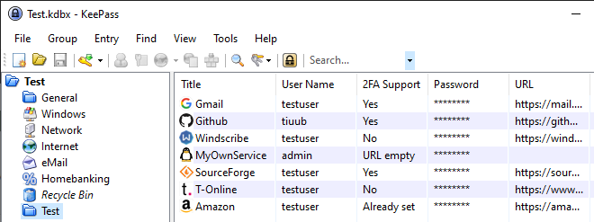
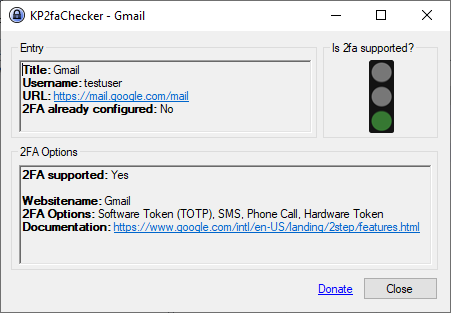
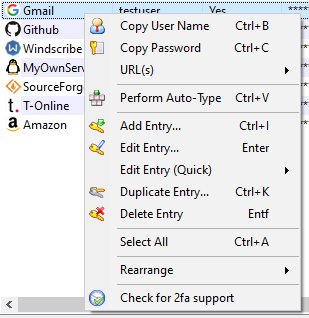
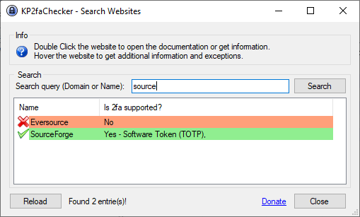

# KP2faChecker
KP2faChecker is a plugin for [KeePass](http://keepass.info). It provides a column and a form to display whether or not they support 2FA.

## Installation

 - Download the latest release [here](https://github.com/tiuub/KP2faChecker/releases/latest)
 - Copy the KP2faChecker.plgx in the KeePass plugins directory and restart the application.

### Alternative Installation
- Using [chocolatey](https://chocolatey.org/) in Powershell with `choco install keepass-plugin-kp2fachecker`

## Usage

### First Method

At first you have to activate the column. Therefore navigate to
 - View -> Configure Columns -> (Scroll down) -> Check "2FA Support"

If you have activated, it should show you the column.

Now you can douple click the column to get additional informations.

### Second Method

Just right click any entry in your database and click on "Check for 2fa support". 

This will open another window with additional informations.

### Third Method

You can search your wanted website by name or domain. Therefore navigate to
- Tools -> KP2faChecker - Search Websites -> Search query.

## Download

You can download the .plgx file [here](https://github.com/tiuub/KP2faChecker/releases/latest).

## Additional Information

I have build my own API [here](https://toasted.top/kp2fac/api/v1/get/all.php), which receives its data from [2fa.directory (formerly twofactorauth.org)](https://2fa.directory/). 
To save resources and also because 2fa.directory isnt changing its data that often, the plugin will only request every 2 days for new added websites. 

## Data privacy

The plugin is requesting a huge json file from a server and compares the domains inside this json locally on your computer. This means your private data will never be sent through the internet.

## License

